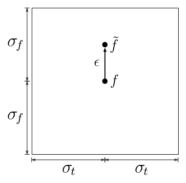

{ width=120px align=right }

`wavyr` is an R package designed for studying traveling waves in space and time.

### Signal-Spectrum Transform Uncertainty

### Rationalizing Spectral Components within the Uncertainty Limit

$\mathbf{\tilde{f}}={f}_{ref} \cdot \operatorname{SB} \left(\frac{\mathbf{f}}{f_{ref}} \mid \Delta f \right)$

$\operatorname{SB} \left(\frac{\mathbf{f}}{f_{ref}} \mid \Delta f \right) = \frac{p}{q}, \quad \gcd(p,q) = 1$

Gabor Uncertainty

$\sigma_t \sigma_f = \frac{1}{4 \pi}$

Using natural units:

$\sigma_t = 1$

Solving for 

$\sigma_f = \frac{1}{4 \pi}$

The perturbation of $f$ to $\tilde{f}$

$\epsilon \leq \sigma_f$

### Relationships among Wave Properties

