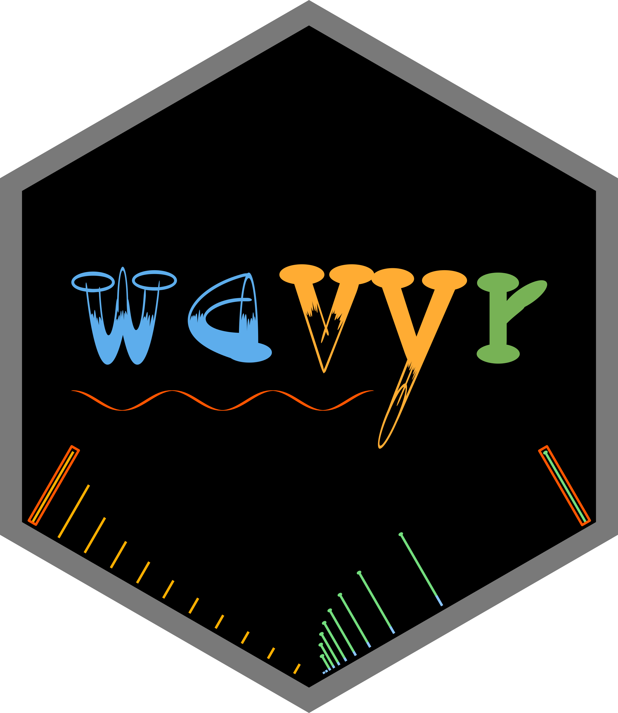
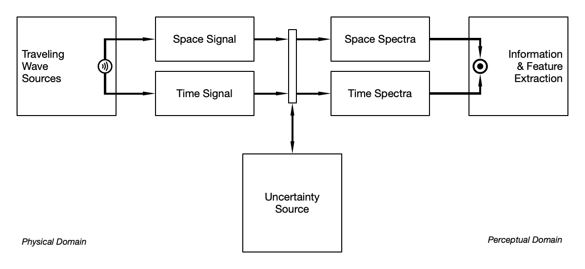
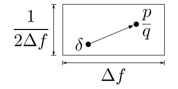
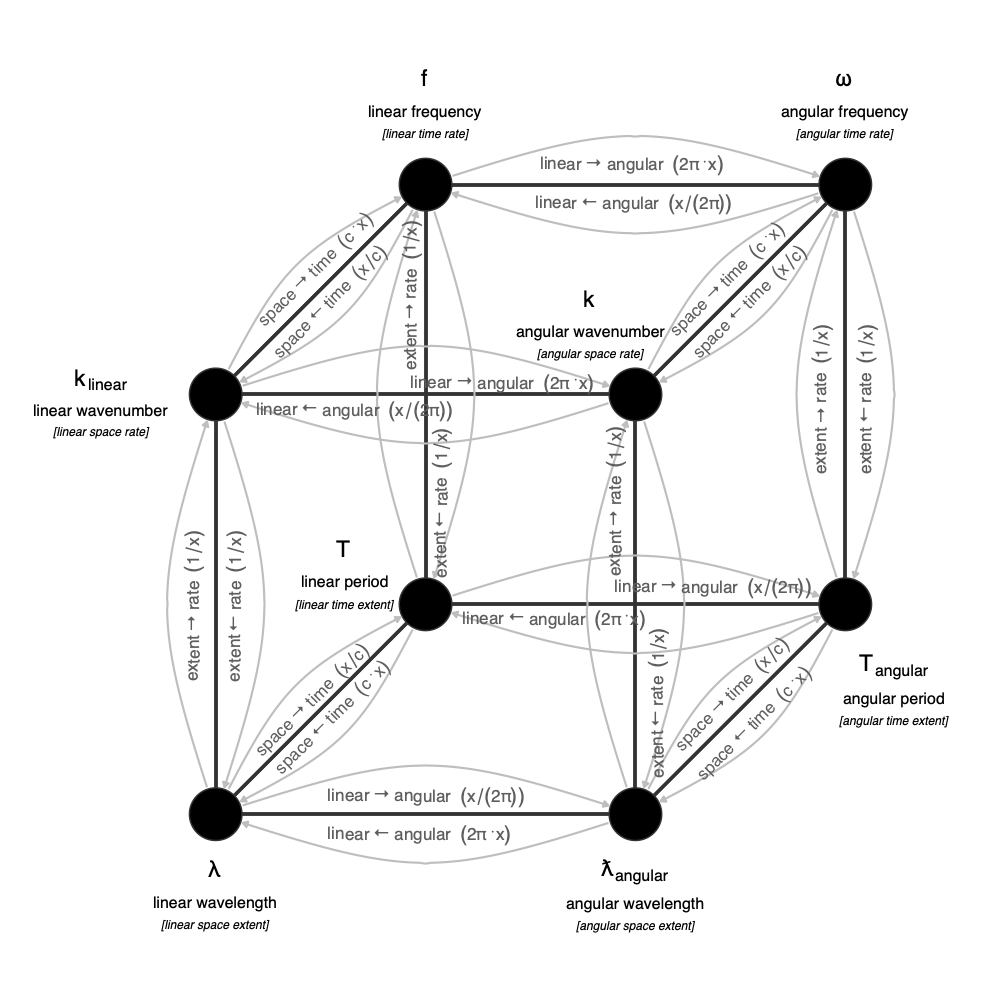

wavyr
================

`wavyr` is an R package designed for studying traveling waves in space
and time.

### Signal-Spectrum Transform Uncertainty

<figure>

<figcaption aria-hidden="true">Schematic diagram of a general
signal-spectrum transform.</figcaption>
</figure>

### Rationalizing Spectral Components within the Uncertainty Limit

<figure>

<figcaption aria-hidden="true">Rationalizing an ideal spectral component
within the uncertainty limit.</figcaption>
</figure>

$\mathbf{f}=\check{f}_{ref} \cdot \operatorname{SB} \left(\frac{\mathbf{\check{f}}}{\check{f}_{ref}} \mid \Delta f \right)$

When we transform a wave from the physical domain to the spectral
domain, uncertainty is introduced. Gabor established the uncertainty
limit for the time-frequency dimension, a principle that also applies to
space-wavenumber dimensions. Rational fraction representations of waves
have proven helpful for feature extraction and fundamental frequency
detection. In our novel method, we combine Gabor uncertainty with
rational fraction approximations of complex waves. We use the
Stern-Brocot tree to locate rational fractions within the Gabor
uncertainty limit, allowing us to create signals and spectra that are
both rational and bounded by the uncertainty product of the entire
waveform. As long as the uncertainty of the sensor system is smaller
than the Gabor uncertainty product, the uncertainty principle enables us
to reliably generate rationalized waveforms, without needing to account
for the intricacies of those sensors or even the uncertainty trade-offs
between the physical and spectral domains. This uncertainty-bounded,
rational-approximation is a parameter-free kernel for Fourier
transformations. This new method, the **Stern-Brocot-Gabor Fourier
Transform**, offers a novel approach for fundamental wave discovery and
feature extraction. By comparing our model to neural models and
experimental studies, we propose that for signals and spectra, the
ambiguity that arises from the Gabor uncertainty principle could be an
enabler of pattern perception.

**The Stern-Brocot-Gabor Fourier Transform:**

*Time-Frequency Dimension*

$$
\phi(\omega) = Q_{SB}(\Delta t \Delta \omega, \ \omega) \int_{-\infty}^\infty \psi(t) \ e^{-i \omega t} \ dt
$$

*Space-Wavenumber Dimension*

$$
\phi(k) = Q_{SB}(\Delta x \Delta k, \ k) \int_{-\infty}^\infty \psi(x) \ e^{-i k x} \ dx
$$

**The Inverse Stern-Brocot-Gabor Fourier Transform:**

*Time-Frequency Dimension*

$$
\psi(t) = \frac{1}{2\pi} \int_{-\infty}^\infty Q_{SB}(\Delta t \Delta \omega, \ \omega) \ \phi(\omega) \ e^{i \omega t} \ d\omega
$$

*Space-Wavenumber Dimension*

$$
\psi(x) = \frac{1}{2\pi} \int_{-\infty}^\infty Q_{SB}(\Delta x \Delta k, \ k) \ \phi(k) \ e^{i k x} \ dk
$$

**The Stern-Brocot-Gabor Quantizer:**

The Stern-Brocot-Gabor quantizer $Q_{SB}(\Delta_G, r)$ traverses the
Stern-Brocot tree of all rational numbers $\mathbb{Q}$ in order, where
fractions with smaller denominators appear earlier in the traversal, and
returns the first rational number that approximates $r$ within the Gabor
uncertainty limit $\Delta_G$.

$$
Q_{SB}(\Delta_G, r) = \frac{p}{q}, \quad \text{where } \left| r - \frac{p}{q} \right| \le \Delta_G \quad \text{and } \gcd(p, q) = 1
$$

The Stern-Brocot-Gabor quantizer ensures that $\frac{p}{q}$ is a
co-prime fraction in simplest form, providing a rational approximation
of $r$ within the specified uncertainty.

#### Uncertainty Principles

*Time-Frequency Uncertainty:*

$$
\Delta t \Delta \omega \geq \frac{1}{2}
$$

*Space-Wavenumber Uncertainty:*

$$
\Delta x \Delta k \geq \frac{1}{2}
$$

*Combined Time-Frequency and Space-Wavenumber Uncertainty:*

$$
\Delta t \Delta \omega \Delta x \Delta k \geq \frac{1}{4}
$$

### Relationships among Wave Properties

<figure>

<figcaption aria-hidden="true">Directed graph of wave
properties.</figcaption>
</figure>
