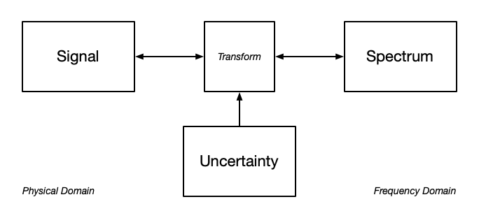

wavyr
================

`wavyr` is an R package designed for studying traveling waves in space
and time.

### Signal-Spectrum Transform Uncertainty

<figure>

<figcaption aria-hidden="true">Signal-spectrum transform
uncertainty.</figcaption>
</figure>

### Rationalizing Spectral Components within the Uncertainty Limit

<figure>

<figcaption aria-hidden="true">A frequency shift to the nearest co-prime
rational fraction within the uncertainty limit.</figcaption>
</figure>

$\mathbf{\tilde{f}}={f}_{ref} \cdot \operatorname{SB} \left(\frac{\mathbf{f}}{f_{ref}} \mid \Delta f \right)$

$\operatorname{SB} \left(\frac{\mathbf{f}}{f_{ref}} \mid \Delta f \right) = \frac{p}{q}, \quad \gcd(p,q) = 1$

Gabor Uncertainty

$\sigma_t \sigma_f = \frac{1}{4 \pi}$

Using natural units:

$\sigma_t = 1$

Solving for

$\sigma_f = \frac{1}{4 \pi}$

The perturbation of $f$ to $\tilde{f}$

$\epsilon \leq \sigma_f$

### Primitive Lattice of Coprime Rational Fractions

<figure>

<figcaption aria-hidden="true">Coprime rational fractions.</figcaption>
</figure>

### Relationships among Wave Properties

<figure>

<figcaption aria-hidden="true">Directed graph of wave
properties.</figcaption>
</figure>

# Outline

- All plots should have a 1D temporal signal (time series), and a 2D
  spatial signal (image).
- Plot a wave that is as close to harmonic as possible but not, like a
  ET P5 relationship with octave doubling.
  - show the idealized
  - show the rationalized
- Plot a wave that is as irrational as possible, like 1, sqrt(3), e, pi.
  - show the idealized
  - show the rationalized
- Images
- Pitch
- EEG
- Seismology
- Optics with Negative Group Velocity
- About the Elementary Signal
